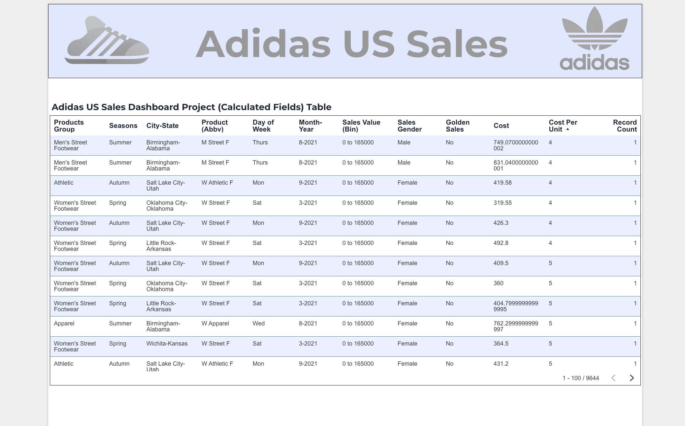

# Adidas-US-Calculated-Fields-Dashboard

This Looker Studio dashboard was built to analyze Adidas US Sales using calculated fields. It explores seasonal performance, profit margins, and the specificities of sales. 

## 💻 Calculated Fields Used

Key Fields Created For this Project:

- State-City Combo
- Product Abbreviation
- Cost and Cost per Unit
- Season Classification
- "Golden Sales" Identifier
- Month-Year labeling 
- Sales Value Bins

👉 Full Detailed Breakdown (along with solutions) available in the [Calculated Fields Project.pdf]

## 📸 📷 Dashboard Preview

## Tools Used 

- Google Looker Studio
- Google Sheets

## Key Takeaways 

- Leveled up my calculated fields knowledge by building some from scratch
- Practice pre-aggregation, binning, and formatting
- Improved dashboard layout and visual storytelling

## Live Dashboard
[Click to view live dashboard] (https://lookerstudio.google.com/reporting/1d89fef8-7bfd-41f6-9537-c1d9888ef3cc)
